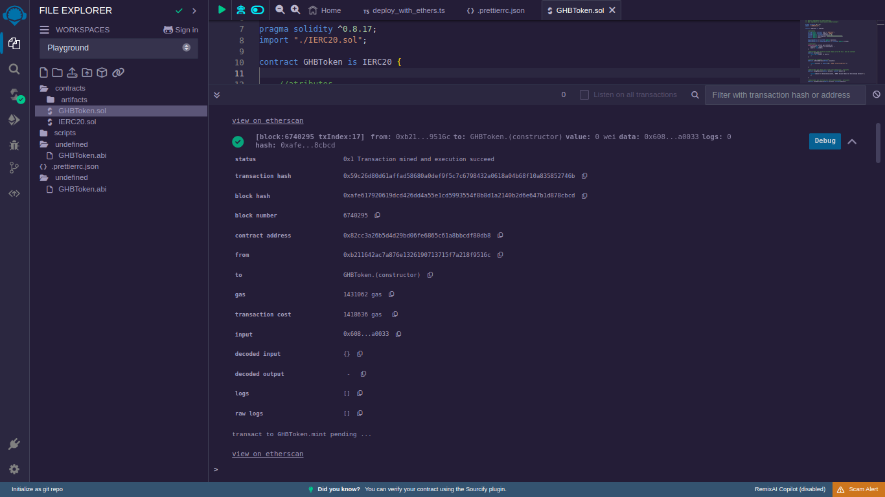
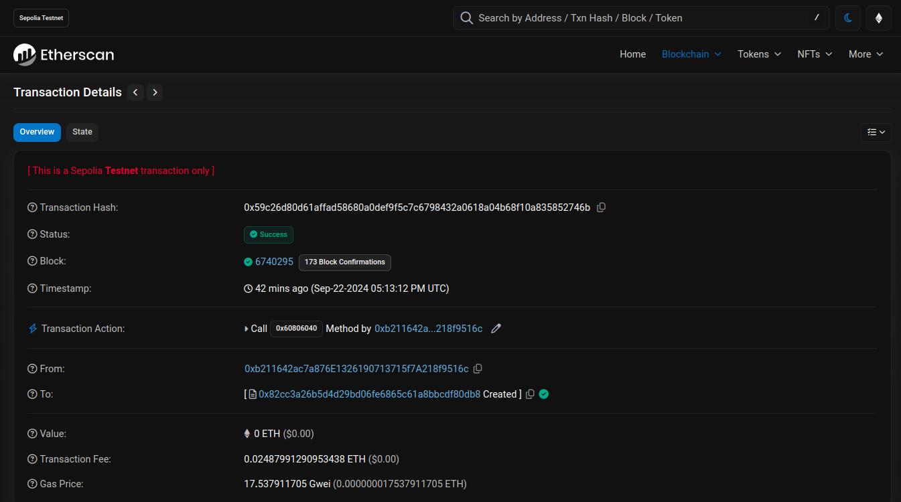
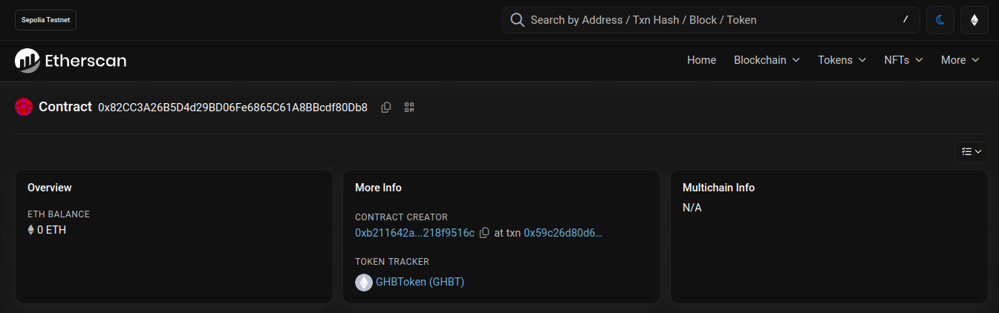
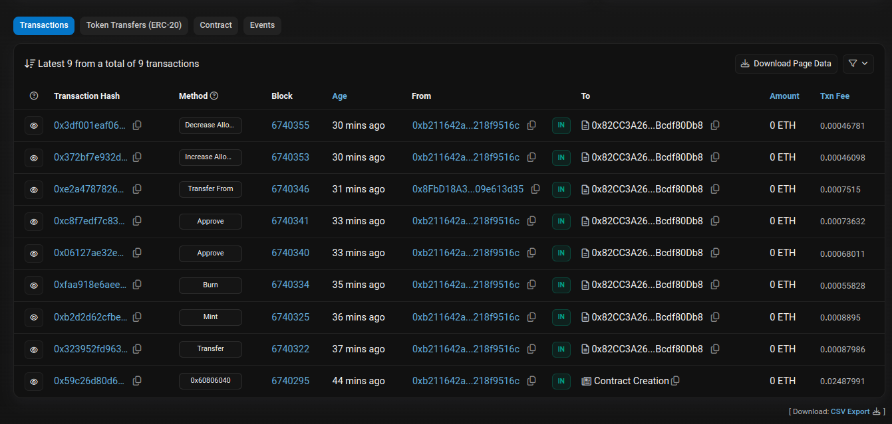

# TokenERC20Mintable

## Descrição

Este repositório contém o código do GHBToken, um token ERC20 Mintable na blockchain Ethereum. Ele foi desenvolvido seguindo o padrão ERC20, permitindo a criação, transferência e queima de tokens. O projeto inclui também funções de permissão para terceiros através de `allowance`, além das funções de `mint` e `burn`, que podem ser executadas apenas pelo proprietário do contrato. O endereço do contrato na testnet Sepolia é `0x82CC3A26B5D4d29BD06Fe6865C61A8BBcdf80Db8`

## Funcionalidades

- Transferência de tokens entre endereços.
- Permissão para que terceiros gastem tokens da sua conta.
- Funções de mint (criação) e burn (queima) de tokens.
- Aumento ou diminuição da quantia permitida para terceiros através de `allowance`.

## Como usar

1. Faça o deploy do contrato em uma rede Ethereum (pode ser em uma testnet como Rinkeby ou Goerli).
2. Use o endereço do contrato para interagir com ele via Remix ou ferramentas como [Metamask](https://metamask.io/) ou [Etherscan](https://etherscan.io).
3. Ou simplemnte interaja com o contrato implantado na rede de testes Sepolia através do seginte endereço: `0x82CC3A26B5D4d29BD06Fe6865C61A8BBcdf80Db8`

## Requisitos

- Solidity ^0.8.0
- Remix IDE ou Hardhat para deploy
- Metamask ou outra carteira para interagir com o contrato e faucets para arcar com os curtos das transações

## Deploy e Interação

Você pode utilizar o Remix IDE ou frameworks como Hardhat para fazer o deploy e interagir com o contrato. Siga as etapas:
1. Compile o contrato no Remix.
2. Faça o deploy na rede Ethereum de sua escolha.
3. Use ferramentas como Metamask para interagir com o contrato e realizar transferências, mint e burn.

## Links Úteis

- [Documentação ERC20](https://ethereum.org/en/developers/docs/standards/tokens/erc-20/)
- [Remix IDE](https://remix.ethereum.org/)
- [Guia Solidity](https://docs.soliditylang.org/)
- [Exemplo de Deploy com Hardhat](https://hardhat.org/getting-started/)

## Exemplos e Capturas de Tela

Abaixo estão algumas imagens do deploy e interações com o token. Todas as informações podem ser consultadas no [Etherscan](https://sepolia.etherscan.io/address/0x82cc3a26b5d4d29bd06fe6865c61a8bbcdf80db8).

### 1. **Deploy do Contrato no Remix IDE**

    

### 2. **Transação de Criação do Contrato vista no Etherscan**

    

### 3. **Informações do Token**

    

### 4. **Lista de transações do contrato**

    

